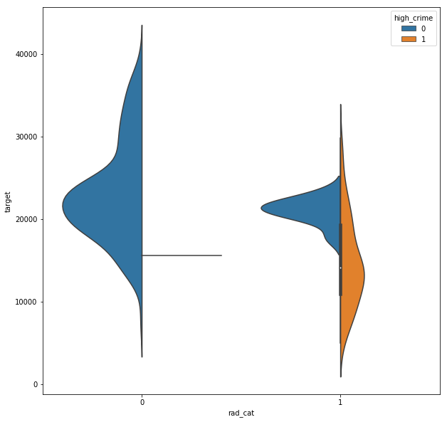

### Questions

### Objectives
YWBAT
* apply feature engineering to data to enhance models

### Outline

What is feature engineering?
- creating features from your data to model the data


```python
import pandas as pd
import numpy as np

import statsmodels.api as sm

from sklearn.datasets import load_boston
from sklearn.linear_model import LinearRegression
from sklearn.model_selection import train_test_split, cross_val_score
from pprint import pprint

import matplotlib.pyplot as plt
import seaborn as sns
```

    /anaconda3/lib/python3.6/site-packages/statsmodels/compat/pandas.py:56: FutureWarning: The pandas.core.datetools module is deprecated and will be removed in a future version. Please use the pandas.tseries module instead.
      from pandas.core import datetools


```python
boston = load_boston()
data = boston.data
target = boston.target
columns = list(boston.feature_names) + ['target']
data = np.column_stack([data, target])
```


```python
df = pd.DataFrame(data, columns=columns)
df['target'] = 1000*df['target']
df.head()
```


### Dropping my high target values (outlier)


```python
df = df[df['target'] < 40000]
```


```python
pd.plotting.scatter_matrix(df, figsize=(20, 20))
plt.show()
```


```python
plt.hist(df["RAD"], bins=20)
```


    (array([ 41.,  36., 107., 103.,  26.,  16.,  19.,   0.,   0.,   0.,   0.,
              0.,   0.,   0.,   0.,   0.,   0.,   0.,   0., 127.]),
     array([ 1.  ,  2.15,  3.3 ,  4.45,  5.6 ,  6.75,  7.9 ,  9.05, 10.2 ,
            11.35, 12.5 , 13.65, 14.8 , 15.95, 17.1 , 18.25, 19.4 , 20.55,
            21.7 , 22.85, 24.  ]),
     <a list of 20 Patch objects>)


```python
df.RAD.value_counts()
```


    24.0    127
    4.0     107
    5.0     103
    3.0      36
    6.0      26
    2.0      22
    8.0      19
    1.0      19
    7.0      16
    Name: RAD, dtype: int64


```python
rad_categories = []
for rad in df.RAD:
    if rad > 10:
        rad_categories.append(1)
    else:
        rad_categories.append(0)
```


```python
df["rad_cat"] = rad_categories
df.head()
```


<div>
<style scoped>
    .dataframe tbody tr th:only-of-type {
        vertical-align: middle;
    }

    .dataframe tbody tr th {
        vertical-align: top;
    }

    .dataframe thead th {
        text-align: right;
    }
</style>
<table border="1" class="dataframe">
  <thead>
    <tr style="text-align: right;">
      <th></th>
      <th>CRIM</th>
      <th>ZN</th>
      <th>INDUS</th>
      <th>CHAS</th>
      <th>NOX</th>
      <th>RM</th>
      <th>AGE</th>
      <th>DIS</th>
      <th>RAD</th>
      <th>TAX</th>
      <th>PTRATIO</th>
      <th>B</th>
      <th>LSTAT</th>
      <th>target</th>
      <th>rad_cat</th>
    </tr>
  </thead>
  <tbody>
    <tr>
      <th>0</th>
      <td>0.00632</td>
      <td>18.0</td>
      <td>2.31</td>
      <td>0.0</td>
      <td>0.538</td>
      <td>6.575</td>
      <td>65.2</td>
      <td>4.0900</td>
      <td>1.0</td>
      <td>296.0</td>
      <td>15.3</td>
      <td>396.90</td>
      <td>4.98</td>
      <td>24000.0</td>
      <td>0</td>
    </tr>
    <tr>
      <th>1</th>
      <td>0.02731</td>
      <td>0.0</td>
      <td>7.07</td>
      <td>0.0</td>
      <td>0.469</td>
      <td>6.421</td>
      <td>78.9</td>
      <td>4.9671</td>
      <td>2.0</td>
      <td>242.0</td>
      <td>17.8</td>
      <td>396.90</td>
      <td>9.14</td>
      <td>21600.0</td>
      <td>0</td>
    </tr>
    <tr>
      <th>2</th>
      <td>0.02729</td>
      <td>0.0</td>
      <td>7.07</td>
      <td>0.0</td>
      <td>0.469</td>
      <td>7.185</td>
      <td>61.1</td>
      <td>4.9671</td>
      <td>2.0</td>
      <td>242.0</td>
      <td>17.8</td>
      <td>392.83</td>
      <td>4.03</td>
      <td>34700.0</td>
      <td>0</td>
    </tr>
    <tr>
      <th>3</th>
      <td>0.03237</td>
      <td>0.0</td>
      <td>2.18</td>
      <td>0.0</td>
      <td>0.458</td>
      <td>6.998</td>
      <td>45.8</td>
      <td>6.0622</td>
      <td>3.0</td>
      <td>222.0</td>
      <td>18.7</td>
      <td>394.63</td>
      <td>2.94</td>
      <td>33400.0</td>
      <td>0</td>
    </tr>
    <tr>
      <th>4</th>
      <td>0.06905</td>
      <td>0.0</td>
      <td>2.18</td>
      <td>0.0</td>
      <td>0.458</td>
      <td>7.147</td>
      <td>54.2</td>
      <td>6.0622</td>
      <td>3.0</td>
      <td>222.0</td>
      <td>18.7</td>
      <td>396.90</td>
      <td>5.33</td>
      <td>36200.0</td>
      <td>0</td>
    </tr>
  </tbody>
</table>
</div>


```python
plt.figure(figsize=(10, 10))
sns.violinplot(x="rad_cat", y="target", data=df)
plt.show()
```


```python
df.shape
```


    (475, 15)


```python
np.corrcoef(df.target, df.rad_cat)
```


    array([[ 1.        , -0.51815814],
           [-0.51815814,  1.        ]])


```python
plt.hist(df.AGE, bins=20)
```


    (array([  7.,   6.,   7.,  22.,   5.,  21.,  22.,  17.,  18.,  13.,  18.,
             18.,  16.,  20.,  18.,  22.,  33.,  34.,  54., 104.]),
     array([  2.9  ,   7.755,  12.61 ,  17.465,  22.32 ,  27.175,  32.03 ,
             36.885,  41.74 ,  46.595,  51.45 ,  56.305,  61.16 ,  66.015,
             70.87 ,  75.725,  80.58 ,  85.435,  90.29 ,  95.145, 100.   ]),
     <a list of 20 Patch objects>)


```python
plt.hist(df.CRIM, bins=30)
```


    (array([347.,  38.,  24.,  21.,  15.,   7.,   7.,   3.,   4.,   1.,   0.,
              0.,   2.,   0.,   1.,   1.,   0.,   1.,   0.,   0.,   0.,   0.,
              1.,   0.,   1.,   0.,   0.,   0.,   0.,   1.]),
     array([6.32000000e-03, 2.97198267e+00, 5.93764533e+00, 8.90330800e+00,
            1.18689707e+01, 1.48346333e+01, 1.78002960e+01, 2.07659587e+01,
            2.37316213e+01, 2.66972840e+01, 2.96629467e+01, 3.26286093e+01,
            3.55942720e+01, 3.85599347e+01, 4.15255973e+01, 4.44912600e+01,
            4.74569227e+01, 5.04225853e+01, 5.33882480e+01, 5.63539107e+01,
            5.93195733e+01, 6.22852360e+01, 6.52508987e+01, 6.82165613e+01,
            7.11822240e+01, 7.41478867e+01, 7.71135493e+01, 8.00792120e+01,
            8.30448747e+01, 8.60105373e+01, 8.89762000e+01]),
     <a list of 30 Patch objects>)


```python
df.CRIM.value_counts()
```


    14.33370    2
    0.08265     1
    0.66351     1
    0.02498     1
    0.10000     1
    0.05515     1
    0.11027     1
    0.01501     1
    4.26131     1
    0.34109     1
    22.59710    1
    0.28955     1
    4.34879     1
    0.10574     1
    3.47428     1
    5.66637     1
    15.87440    1
    0.04297     1
    0.78570     1
    0.29090     1
    1.23247     1
    2.44953     1
    0.09512     1
    0.05425     1
    0.17783     1
    88.97620    1
    0.11747     1
    0.03445     1
    0.34940     1
    0.12650     1
               ..
    5.69175     1
    3.16360     1
    0.07022     1
    0.02187     1
    8.05579     1
    10.06230    1
    41.52920    1
    0.32264     1
    0.04379     1
    0.22212     1
    0.13117     1
    0.51183     1
    6.28807     1
    0.08826     1
    24.80170    1
    0.09065     1
    23.64820    1
    3.56868     1
    12.80230    1
    0.72580     1
    0.03113     1
    13.67810    1
    0.88125     1
    0.01951     1
    0.49298     1
    0.26838     1
    0.11460     1
    0.03237     1
    2.73397     1
    0.84054     1
    Name: CRIM, Length: 474, dtype: int64


```python
df.CRIM.describe()
```


    count    475.000000
    mean       3.747852
    std        8.838669
    min        0.006320
    25%        0.082545
    50%        0.241030
    75%        3.735965
    max       88.976200
    Name: CRIM, dtype: float64


```python
plt.hist(df.CRIM, bins=30)
plt.show()
```


```python
df["high_crime"] = [1 if crime > 3.7 else 0 for crime in df.CRIM]
```


```python
plt.hist(df.high_crime)
```


    (array([356.,   0.,   0.,   0.,   0.,   0.,   0.,   0.,   0., 119.]),
     array([0. , 0.1, 0.2, 0.3, 0.4, 0.5, 0.6, 0.7, 0.8, 0.9, 1. ]),
     <a list of 10 Patch objects>)


```python
plt.figure(figsize=(10, 10))
sns.violinplot(x="rad_cat", y="target", data=df, hue='high_crime', split=True)
plt.show()
```





```python
plt.scatter(x=df.RAD, y=df.target, c=df.high_crime, alpha=0.5)
plt.xlabel('rad')
plt.ylabel('target')
plt.show()
```


```python
rad_crime = []
for crime, rad in zip(df.high_crime, df.rad_cat):
    if crime == 1 and rad == 1:
        rad_crime.append(1)
    else:
        rad_crime.append(0)
df['rad_crime'] = rad_crime
df.head()
```


<div>
<style scoped>
    .dataframe tbody tr th:only-of-type {
        vertical-align: middle;
    }

    .dataframe tbody tr th {
        vertical-align: top;
    }

    .dataframe thead th {
        text-align: right;
    }
</style>
<table border="1" class="dataframe">
  <thead>
    <tr style="text-align: right;">
      <th></th>
      <th>CRIM</th>
      <th>ZN</th>
      <th>INDUS</th>
      <th>CHAS</th>
      <th>NOX</th>
      <th>RM</th>
      <th>AGE</th>
      <th>DIS</th>
      <th>RAD</th>
      <th>TAX</th>
      <th>PTRATIO</th>
      <th>B</th>
      <th>LSTAT</th>
      <th>target</th>
      <th>rad_cat</th>
      <th>high_crime</th>
      <th>rad_crime</th>
    </tr>
  </thead>
  <tbody>
    <tr>
      <th>0</th>
      <td>0.00632</td>
      <td>18.0</td>
      <td>2.31</td>
      <td>0.0</td>
      <td>0.538</td>
      <td>6.575</td>
      <td>65.2</td>
      <td>4.0900</td>
      <td>1.0</td>
      <td>296.0</td>
      <td>15.3</td>
      <td>396.90</td>
      <td>4.98</td>
      <td>24000.0</td>
      <td>0</td>
      <td>0</td>
      <td>0</td>
    </tr>
    <tr>
      <th>1</th>
      <td>0.02731</td>
      <td>0.0</td>
      <td>7.07</td>
      <td>0.0</td>
      <td>0.469</td>
      <td>6.421</td>
      <td>78.9</td>
      <td>4.9671</td>
      <td>2.0</td>
      <td>242.0</td>
      <td>17.8</td>
      <td>396.90</td>
      <td>9.14</td>
      <td>21600.0</td>
      <td>0</td>
      <td>0</td>
      <td>0</td>
    </tr>
    <tr>
      <th>2</th>
      <td>0.02729</td>
      <td>0.0</td>
      <td>7.07</td>
      <td>0.0</td>
      <td>0.469</td>
      <td>7.185</td>
      <td>61.1</td>
      <td>4.9671</td>
      <td>2.0</td>
      <td>242.0</td>
      <td>17.8</td>
      <td>392.83</td>
      <td>4.03</td>
      <td>34700.0</td>
      <td>0</td>
      <td>0</td>
      <td>0</td>
    </tr>
    <tr>
      <th>3</th>
      <td>0.03237</td>
      <td>0.0</td>
      <td>2.18</td>
      <td>0.0</td>
      <td>0.458</td>
      <td>6.998</td>
      <td>45.8</td>
      <td>6.0622</td>
      <td>3.0</td>
      <td>222.0</td>
      <td>18.7</td>
      <td>394.63</td>
      <td>2.94</td>
      <td>33400.0</td>
      <td>0</td>
      <td>0</td>
      <td>0</td>
    </tr>
    <tr>
      <th>4</th>
      <td>0.06905</td>
      <td>0.0</td>
      <td>2.18</td>
      <td>0.0</td>
      <td>0.458</td>
      <td>7.147</td>
      <td>54.2</td>
      <td>6.0622</td>
      <td>3.0</td>
      <td>222.0</td>
      <td>18.7</td>
      <td>396.90</td>
      <td>5.33</td>
      <td>36200.0</td>
      <td>0</td>
      <td>0</td>
      <td>0</td>
    </tr>
  </tbody>
</table>
</div>


```python
corr = df[['CRIM', 'RAD', 'target']].corr()
corr.head()
```


<div>
<style scoped>
    .dataframe tbody tr th:only-of-type {
        vertical-align: middle;
    }

    .dataframe tbody tr th {
        vertical-align: top;
    }

    .dataframe thead th {
        text-align: right;
    }
</style>
<table border="1" class="dataframe">
  <thead>
    <tr style="text-align: right;">
      <th></th>
      <th>CRIM</th>
      <th>RAD</th>
      <th>target</th>
    </tr>
  </thead>
  <tbody>
    <tr>
      <th>CRIM</th>
      <td>1.000000</td>
      <td>0.625818</td>
      <td>-0.488403</td>
    </tr>
    <tr>
      <th>RAD</th>
      <td>0.625818</td>
      <td>1.000000</td>
      <td>-0.509836</td>
    </tr>
    <tr>
      <th>target</th>
      <td>-0.488403</td>
      <td>-0.509836</td>
      <td>1.000000</td>
    </tr>
  </tbody>
</table>
</div>


```python
corr.shape
```


    (3, 3)


```python
sns.heatmap(corr, fmt='0.2g', annot=True, cmap=sns.color_palette('coolwarm'))
plt.show()
```


```python
plt.figure(figsize=(10, 10))
sns.violinplot(x='rad_crime', y='target', data=df)
plt.show()
```


```python
np.corrcoef([df.CRIM + df.RAD], df.target)
```


    array([[ 1.        , -0.55354958],
           [-0.55354958,  1.        ]])


```python
# df.CRIM -> crime rate
# df.RAD -> radius from train lines (public transportation)

weights = np.linspace(0, 1, 10000)
max_corr = -1
best_weights = None
corrs = []

for index, weight in enumerate(weights):
    w1 = weight # get the first weight value
    w2 = 1 - weight # get the second weight value
    vals = w1*df.CRIM + w2*df.RAD # create a linear combination of the columns
    corr_coeff = np.abs(np.corrcoef(vals, df.target))[0][1] # get the corrcoeff with the target
    
    # if the corr_coeff is larger than the max, store the weights and change the max
    if corr_coeff > max_corr:
        best_weights = [w1, w2]
        max_corr = corr_coeff
        
    # store the correlation coefficients to a list
    corrs.append(corr_coeff)  
    
# output the desired weights
best_weights
```


    [0.451945194519452, 0.5480548054805481]


```python
# plot the w1 vs coeff 
plt.figure(figsize=(8, 5))
plt.plot(weights, corrs)
plt.vlines(x=best_weights[0], ymin=0.48, ymax=max_corr, linestyle='--', colors='r', linewidth=2, label='max corr')
plt.legend()
plt.xlabel("w1")
plt.ylabel("corr coeff")
plt.show()
```


```python
df['crime_rad_feature'] = desired_weights[0]*df.CRIM + desired_weights[1]*df.RAD
```

### Assessment

### Study group May 29


```python
df = pd.DataFrame(data, columns=columns)
df.head()
```


<div>
<style scoped>
    .dataframe tbody tr th:only-of-type {
        vertical-align: middle;
    }

    .dataframe tbody tr th {
        vertical-align: top;
    }

    .dataframe thead th {
        text-align: right;
    }
</style>
<table border="1" class="dataframe">
  <thead>
    <tr style="text-align: right;">
      <th></th>
      <th>CRIM</th>
      <th>ZN</th>
      <th>INDUS</th>
      <th>CHAS</th>
      <th>NOX</th>
      <th>RM</th>
      <th>AGE</th>
      <th>DIS</th>
      <th>RAD</th>
      <th>TAX</th>
      <th>PTRATIO</th>
      <th>B</th>
      <th>LSTAT</th>
      <th>target</th>
    </tr>
  </thead>
  <tbody>
    <tr>
      <th>0</th>
      <td>0.00632</td>
      <td>18.0</td>
      <td>2.31</td>
      <td>0.0</td>
      <td>0.538</td>
      <td>6.575</td>
      <td>65.2</td>
      <td>4.0900</td>
      <td>1.0</td>
      <td>296.0</td>
      <td>15.3</td>
      <td>396.90</td>
      <td>4.98</td>
      <td>24.0</td>
    </tr>
    <tr>
      <th>1</th>
      <td>0.02731</td>
      <td>0.0</td>
      <td>7.07</td>
      <td>0.0</td>
      <td>0.469</td>
      <td>6.421</td>
      <td>78.9</td>
      <td>4.9671</td>
      <td>2.0</td>
      <td>242.0</td>
      <td>17.8</td>
      <td>396.90</td>
      <td>9.14</td>
      <td>21.6</td>
    </tr>
    <tr>
      <th>2</th>
      <td>0.02729</td>
      <td>0.0</td>
      <td>7.07</td>
      <td>0.0</td>
      <td>0.469</td>
      <td>7.185</td>
      <td>61.1</td>
      <td>4.9671</td>
      <td>2.0</td>
      <td>242.0</td>
      <td>17.8</td>
      <td>392.83</td>
      <td>4.03</td>
      <td>34.7</td>
    </tr>
    <tr>
      <th>3</th>
      <td>0.03237</td>
      <td>0.0</td>
      <td>2.18</td>
      <td>0.0</td>
      <td>0.458</td>
      <td>6.998</td>
      <td>45.8</td>
      <td>6.0622</td>
      <td>3.0</td>
      <td>222.0</td>
      <td>18.7</td>
      <td>394.63</td>
      <td>2.94</td>
      <td>33.4</td>
    </tr>
    <tr>
      <th>4</th>
      <td>0.06905</td>
      <td>0.0</td>
      <td>2.18</td>
      <td>0.0</td>
      <td>0.458</td>
      <td>7.147</td>
      <td>54.2</td>
      <td>6.0622</td>
      <td>3.0</td>
      <td>222.0</td>
      <td>18.7</td>
      <td>396.90</td>
      <td>5.33</td>
      <td>36.2</td>
    </tr>
  </tbody>
</table>
</div>


```python
def make_histogram(df, column, bins=20, title=None, alpha=.5, grid=True):
    plt.figure(figsize=(8, 5))
    if grid:
        plt.grid()
    plt.hist(df[column], bins=bins, alpha=alpha)
    if title:
        plt.title(title)
    plt.xlabel(column)
    plt.ylabel('counts')
    plt.show()
    pass


def sm_ols(df, cols, target='target', intercept=False):
    x = df[cols]
    y = df[target]
    if intercept:
        x = sm.add_constant(x)
    
    linreg = sm.OLS(y, x).fit()
    print(linreg.summary())
    return linreg


def make_lmplot(x=None, y=None, df=None):
    plt.figure(figsize=(8, 5))
    sns.lmplot(x=x, y=y, data=df)
    plt.show()
    pass


def get_z_scores(df, col):
    return (df[col] - df[col].mean()) / df[col].std()
```

### Let's assume cleaning is over, columns are normalized and standardized, etc

# Example Question:

## Q1: Does age effect the target at all? 

** Investigation + Visualiations**


```python
make_lmplot(x='AGE', y='target', df=df)
```


    <matplotlib.figure.Figure at 0x1c2588d080>


```python
# Let's investigate the outlier for age
make_histogram(df, 'AGE')
```


*Histogram Insights*

Our data is heavily skewed to the right with very little data below the mid 20s. 

Perhaps we can try normalization and see how it effects the correlation.


```python
df['log_age'] = np.log(df.AGE)
```


```python
df.AGE.describe()
```


    count    506.000000
    mean      68.574901
    std       28.148861
    min        2.900000
    25%       45.025000
    50%       77.500000
    75%       94.075000
    max      100.000000
    Name: AGE, dtype: float64


```python
agedf = df[df['AGE']>23] # remove age values below 23
```


```python
make_histogram(agedf, 'log_age')
```


```python
x = df['AGE']
y = df['target']
linreg = sm.OLS(y, x).fit()
linreg.summary()
```


<table class="simpletable">
<caption>OLS Regression Results</caption>
<tr>
  <th>Dep. Variable:</th>         <td>target</td>      <th>  R-squared:         </th> <td>   0.644</td> 
</tr>
<tr>
  <th>Model:</th>                   <td>OLS</td>       <th>  Adj. R-squared:    </th> <td>   0.644</td> 
</tr>
<tr>
  <th>Method:</th>             <td>Least Squares</td>  <th>  F-statistic:       </th> <td>   915.1</td> 
</tr>
<tr>
  <th>Date:</th>             <td>Wed, 29 May 2019</td> <th>  Prob (F-statistic):</th> <td>1.85e-115</td>
</tr>
<tr>
  <th>Time:</th>                 <td>14:26:01</td>     <th>  Log-Likelihood:    </th> <td> -2071.5</td> 
</tr>
<tr>
  <th>No. Observations:</th>      <td>   506</td>      <th>  AIC:               </th> <td>   4145.</td> 
</tr>
<tr>
  <th>Df Residuals:</th>          <td>   505</td>      <th>  BIC:               </th> <td>   4149.</td> 
</tr>
<tr>
  <th>Df Model:</th>              <td>     1</td>      <th>                     </th>     <td> </td>    
</tr>
<tr>
  <th>Covariance Type:</th>      <td>nonrobust</td>    <th>                     </th>     <td> </td>    
</tr>
</table>
<table class="simpletable">
<tr>
   <td></td>      <th>coef</th>     <th>std err</th>      <th>t</th>      <th>P>|t|</th>  <th>[0.025</th>    <th>0.975]</th>  
</tr>
<tr>
  <th>AGE</th> <td>    0.2636</td> <td>    0.009</td> <td>   30.250</td> <td> 0.000</td> <td>    0.246</td> <td>    0.281</td>
</tr>
</table>
<table class="simpletable">
<tr>
  <th>Omnibus:</th>       <td>27.739</td> <th>  Durbin-Watson:     </th> <td>   0.357</td>
</tr>
<tr>
  <th>Prob(Omnibus):</th> <td> 0.000</td> <th>  Jarque-Bera (JB):  </th> <td>  19.564</td>
</tr>
<tr>
  <th>Skew:</th>          <td> 0.369</td> <th>  Prob(JB):          </th> <td>5.65e-05</td>
</tr>
<tr>
  <th>Kurtosis:</th>      <td> 2.380</td> <th>  Cond. No.          </th> <td>    1.00</td>
</tr>
</table>


*Insights from OLS*

Based on the OLS we see that the **AGE** has a 0.64 r2 score for describing the variance of our target.

We also see that it has a coefficient of 0.2636 which implies that it has a very minor positive correlation with our target. 

### Our model seems to be thrown off by our target outliers


```python
make_histogram(df, 'target')
```


```python
# Let's remove all of the target values above 40
shortdf = df[df.target < 40]
```


```python
# our histogram now looks more normal than before
make_histogram(shortdf, 'target')
```


```python
sm_ols(shortdf, cols=['AGE'])
```

                                OLS Regression Results                            
    ==============================================================================
    Dep. Variable:                 target   R-squared:                       0.670
    Model:                            OLS   Adj. R-squared:                  0.669
    Method:                 Least Squares   F-statistic:                     960.6
    Date:                Wed, 29 May 2019   Prob (F-statistic):          4.63e-116
    Time:                        14:37:41   Log-Likelihood:                -1878.8
    No. Observations:                 475   AIC:                             3760.
    Df Residuals:                     474   BIC:                             3764.
    Df Model:                           1                                         
    Covariance Type:            nonrobust                                         
    ==============================================================================
                     coef    std err          t      P>|t|      [0.025      0.975]
    ------------------------------------------------------------------------------
    AGE            0.2424      0.008     30.993      0.000       0.227       0.258
    ==============================================================================
    Omnibus:                       58.352   Durbin-Watson:                   0.294
    Prob(Omnibus):                  0.000   Jarque-Bera (JB):               19.302
    Skew:                           0.219   Prob(JB):                     6.44e-05
    Kurtosis:                       2.115   Cond. No.                         1.00
    ==============================================================================
    
    Warnings:
    [1] Standard Errors assume that the covariance matrix of the errors is correctly specified.


    <statsmodels.regression.linear_model.RegressionResultsWrapper at 0x1c2588fa58>


```python
make_lmplot(x='AGE', y='target', df=shortdf)
```


    <matplotlib.figure.Figure at 0x1c256fc748>


Looking at the plot above we see that when AGE>80 and target>35 we have outliers.

Let's remove them and see how this effects the relationship


```python
removedf = shortdf.loc[(shortdf.AGE > 80) & (shortdf.target > 35)]
removedf.head()
```


<div>
<style scoped>
    .dataframe tbody tr th:only-of-type {
        vertical-align: middle;
    }

    .dataframe tbody tr th {
        vertical-align: top;
    }

    .dataframe thead th {
        text-align: right;
    }
</style>
<table border="1" class="dataframe">
  <thead>
    <tr style="text-align: right;">
      <th></th>
      <th>CRIM</th>
      <th>ZN</th>
      <th>INDUS</th>
      <th>CHAS</th>
      <th>NOX</th>
      <th>RM</th>
      <th>AGE</th>
      <th>DIS</th>
      <th>RAD</th>
      <th>TAX</th>
      <th>PTRATIO</th>
      <th>B</th>
      <th>LSTAT</th>
      <th>target</th>
      <th>log_age</th>
    </tr>
  </thead>
  <tbody>
    <tr>
      <th>180</th>
      <td>0.06588</td>
      <td>0.0</td>
      <td>2.46</td>
      <td>0.0</td>
      <td>0.488</td>
      <td>7.765</td>
      <td>83.3</td>
      <td>2.7410</td>
      <td>3.0</td>
      <td>193.0</td>
      <td>17.8</td>
      <td>395.56</td>
      <td>7.56</td>
      <td>39.8</td>
      <td>4.422449</td>
    </tr>
    <tr>
      <th>182</th>
      <td>0.09103</td>
      <td>0.0</td>
      <td>2.46</td>
      <td>0.0</td>
      <td>0.488</td>
      <td>7.155</td>
      <td>92.2</td>
      <td>2.7006</td>
      <td>3.0</td>
      <td>193.0</td>
      <td>17.8</td>
      <td>394.12</td>
      <td>4.82</td>
      <td>37.9</td>
      <td>4.523960</td>
    </tr>
    <tr>
      <th>226</th>
      <td>0.38214</td>
      <td>0.0</td>
      <td>6.20</td>
      <td>0.0</td>
      <td>0.504</td>
      <td>8.040</td>
      <td>86.5</td>
      <td>3.2157</td>
      <td>8.0</td>
      <td>307.0</td>
      <td>17.4</td>
      <td>387.38</td>
      <td>3.13</td>
      <td>37.6</td>
      <td>4.460144</td>
    </tr>
    <tr>
      <th>258</th>
      <td>0.66351</td>
      <td>20.0</td>
      <td>3.97</td>
      <td>0.0</td>
      <td>0.647</td>
      <td>7.333</td>
      <td>100.0</td>
      <td>1.8946</td>
      <td>5.0</td>
      <td>264.0</td>
      <td>13.0</td>
      <td>383.29</td>
      <td>7.79</td>
      <td>36.0</td>
      <td>4.605170</td>
    </tr>
    <tr>
      <th>264</th>
      <td>0.55007</td>
      <td>20.0</td>
      <td>3.97</td>
      <td>0.0</td>
      <td>0.647</td>
      <td>7.206</td>
      <td>91.6</td>
      <td>1.9301</td>
      <td>5.0</td>
      <td>264.0</td>
      <td>13.0</td>
      <td>387.89</td>
      <td>8.10</td>
      <td>36.5</td>
      <td>4.517431</td>
    </tr>
  </tbody>
</table>
</div>


```python
shorterdf = df.iloc[[index not in removedf.index for index in shortdf.index]]
shorterdf.head()
```


<div>
<style scoped>
    .dataframe tbody tr th:only-of-type {
        vertical-align: middle;
    }

    .dataframe tbody tr th {
        vertical-align: top;
    }

    .dataframe thead th {
        text-align: right;
    }
</style>
<table border="1" class="dataframe">
  <thead>
    <tr style="text-align: right;">
      <th></th>
      <th>CRIM</th>
      <th>ZN</th>
      <th>INDUS</th>
      <th>CHAS</th>
      <th>NOX</th>
      <th>RM</th>
      <th>AGE</th>
      <th>DIS</th>
      <th>RAD</th>
      <th>TAX</th>
      <th>PTRATIO</th>
      <th>B</th>
      <th>LSTAT</th>
      <th>target</th>
      <th>log_age</th>
    </tr>
  </thead>
  <tbody>
    <tr>
      <th>0</th>
      <td>0.00632</td>
      <td>18.0</td>
      <td>2.31</td>
      <td>0.0</td>
      <td>0.538</td>
      <td>6.575</td>
      <td>65.2</td>
      <td>4.0900</td>
      <td>1.0</td>
      <td>296.0</td>
      <td>15.3</td>
      <td>396.90</td>
      <td>4.98</td>
      <td>24.0</td>
      <td>4.177459</td>
    </tr>
    <tr>
      <th>1</th>
      <td>0.02731</td>
      <td>0.0</td>
      <td>7.07</td>
      <td>0.0</td>
      <td>0.469</td>
      <td>6.421</td>
      <td>78.9</td>
      <td>4.9671</td>
      <td>2.0</td>
      <td>242.0</td>
      <td>17.8</td>
      <td>396.90</td>
      <td>9.14</td>
      <td>21.6</td>
      <td>4.368181</td>
    </tr>
    <tr>
      <th>2</th>
      <td>0.02729</td>
      <td>0.0</td>
      <td>7.07</td>
      <td>0.0</td>
      <td>0.469</td>
      <td>7.185</td>
      <td>61.1</td>
      <td>4.9671</td>
      <td>2.0</td>
      <td>242.0</td>
      <td>17.8</td>
      <td>392.83</td>
      <td>4.03</td>
      <td>34.7</td>
      <td>4.112512</td>
    </tr>
    <tr>
      <th>3</th>
      <td>0.03237</td>
      <td>0.0</td>
      <td>2.18</td>
      <td>0.0</td>
      <td>0.458</td>
      <td>6.998</td>
      <td>45.8</td>
      <td>6.0622</td>
      <td>3.0</td>
      <td>222.0</td>
      <td>18.7</td>
      <td>394.63</td>
      <td>2.94</td>
      <td>33.4</td>
      <td>3.824284</td>
    </tr>
    <tr>
      <th>4</th>
      <td>0.06905</td>
      <td>0.0</td>
      <td>2.18</td>
      <td>0.0</td>
      <td>0.458</td>
      <td>7.147</td>
      <td>54.2</td>
      <td>6.0622</td>
      <td>3.0</td>
      <td>222.0</td>
      <td>18.7</td>
      <td>396.90</td>
      <td>5.33</td>
      <td>36.2</td>
      <td>3.992681</td>
    </tr>
  </tbody>
</table>
</div>


```python
shorterdf.shape, shortdf.shape
```


    ((470, 15), (475, 15))


```python
make_lmplot(x='AGE', y='target', df=shorterdf)
```


    <matplotlib.figure.Figure at 0x1c252e40f0>


Let's investigate an ols model for this new dataframe


```python
sm_ols(shorterdf, cols=['AGE'])
```

                                OLS Regression Results                            
    ==============================================================================
    Dep. Variable:                 target   R-squared:                       0.639
    Model:                            OLS   Adj. R-squared:                  0.638
    Method:                 Least Squares   F-statistic:                     829.9
    Date:                Wed, 29 May 2019   Prob (F-statistic):          8.28e-106
    Time:                        14:50:36   Log-Likelihood:                -1933.4
    No. Observations:                 470   AIC:                             3869.
    Df Residuals:                     469   BIC:                             3873.
    Df Model:                           1                                         
    Covariance Type:            nonrobust                                         
    ==============================================================================
                     coef    std err          t      P>|t|      [0.025      0.975]
    ------------------------------------------------------------------------------
    AGE            0.2655      0.009     28.808      0.000       0.247       0.284
    ==============================================================================
    Omnibus:                       31.115   Durbin-Watson:                   0.354
    Prob(Omnibus):                  0.000   Jarque-Bera (JB):               19.050
    Skew:                           0.352   Prob(JB):                     7.30e-05
    Kurtosis:                       2.310   Cond. No.                         1.00
    ==============================================================================
    
    Warnings:
    [1] Standard Errors assume that the covariance matrix of the errors is correctly specified.


    <statsmodels.regression.linear_model.RegressionResultsWrapper at 0x1c25750780>


### Conclusion
*Findings*

Based on my findings, after removing outliers, it is evident that there is a positive correlation with the age and the target.  

*Recommendations*

Given this relationships, I would recommend that if a buyer wants a home with a smaller median value, then they should be looking in areas where home ownership, for homes greater than 40 years old, is a small percentage. 


```python
sm_ols(shortdf, cols=['AGE', 'RAD', 'PTRATIO'])
```

                                OLS Regression Results                            
    ==============================================================================
    Dep. Variable:                 target   R-squared:                       0.901
    Model:                            OLS   Adj. R-squared:                  0.900
    Method:                 Least Squares   F-statistic:                     1434.
    Date:                Wed, 29 May 2019   Prob (F-statistic):          1.18e-236
    Time:                        14:53:54   Log-Likelihood:                -1592.3
    No. Observations:                 475   AIC:                             3191.
    Df Residuals:                     472   BIC:                             3203.
    Df Model:                           3                                         
    Covariance Type:            nonrobust                                         
    ==============================================================================
                     coef    std err          t      P>|t|      [0.025      0.975]
    ------------------------------------------------------------------------------
    AGE           -0.0607      0.013     -4.793      0.000      -0.086      -0.036
    RAD           -0.4097      0.041    -10.017      0.000      -0.490      -0.329
    PTRATIO        1.5344      0.047     32.580      0.000       1.442       1.627
    ==============================================================================
    Omnibus:                       31.750   Durbin-Watson:                   0.544
    Prob(Omnibus):                  0.000   Jarque-Bera (JB):               36.226
    Skew:                           0.650   Prob(JB):                     1.36e-08
    Kurtosis:                       3.375   Cond. No.                         11.8
    ==============================================================================
    
    Warnings:
    [1] Standard Errors assume that the covariance matrix of the errors is correctly specified.


    <statsmodels.regression.linear_model.RegressionResultsWrapper at 0x1c256e3160>


```python
df['z_age'] = get_z_scores(df, 'AGE')
```


```python
make_histogram(df, 'z_age')
```


```python
sm_ols(df, cols=['AGE'])
```

                                OLS Regression Results                            
    ==============================================================================
    Dep. Variable:                 target   R-squared:                       0.644
    Model:                            OLS   Adj. R-squared:                  0.644
    Method:                 Least Squares   F-statistic:                     915.1
    Date:                Wed, 29 May 2019   Prob (F-statistic):          1.85e-115
    Time:                        15:03:19   Log-Likelihood:                -2071.5
    No. Observations:                 506   AIC:                             4145.
    Df Residuals:                     505   BIC:                             4149.
    Df Model:                           1                                         
    Covariance Type:            nonrobust                                         
    ==============================================================================
                     coef    std err          t      P>|t|      [0.025      0.975]
    ------------------------------------------------------------------------------
    AGE            0.2636      0.009     30.250      0.000       0.246       0.281
    ==============================================================================
    Omnibus:                       27.739   Durbin-Watson:                   0.357
    Prob(Omnibus):                  0.000   Jarque-Bera (JB):               19.564
    Skew:                           0.369   Prob(JB):                     5.65e-05
    Kurtosis:                       2.380   Cond. No.                         1.00
    ==============================================================================
    
    Warnings:
    [1] Standard Errors assume that the covariance matrix of the errors is correctly specified.


    <statsmodels.regression.linear_model.RegressionResultsWrapper at 0x1c25fe1470>


### What did we learn?
* removing outliers using pandas


```python
data = pd.read_csv("kc_house_data.csv")
data.head()
```


<div>
<style scoped>
    .dataframe tbody tr th:only-of-type {
        vertical-align: middle;
    }

    .dataframe tbody tr th {
        vertical-align: top;
    }

    .dataframe thead th {
        text-align: right;
    }
</style>
<table border="1" class="dataframe">
  <thead>
    <tr style="text-align: right;">
      <th></th>
      <th>id</th>
      <th>date</th>
      <th>price</th>
      <th>bedrooms</th>
      <th>bathrooms</th>
      <th>sqft_living</th>
      <th>sqft_lot</th>
      <th>floors</th>
      <th>waterfront</th>
      <th>view</th>
      <th>...</th>
      <th>grade</th>
      <th>sqft_above</th>
      <th>sqft_basement</th>
      <th>yr_built</th>
      <th>yr_renovated</th>
      <th>zipcode</th>
      <th>lat</th>
      <th>long</th>
      <th>sqft_living15</th>
      <th>sqft_lot15</th>
    </tr>
  </thead>
  <tbody>
    <tr>
      <th>0</th>
      <td>7129300520</td>
      <td>10/13/2014</td>
      <td>221900.0</td>
      <td>3</td>
      <td>1.00</td>
      <td>1180</td>
      <td>5650</td>
      <td>1.0</td>
      <td>NaN</td>
      <td>0.0</td>
      <td>...</td>
      <td>7</td>
      <td>1180</td>
      <td>0.0</td>
      <td>1955</td>
      <td>0.0</td>
      <td>98178</td>
      <td>47.5112</td>
      <td>-122.257</td>
      <td>1340</td>
      <td>5650</td>
    </tr>
    <tr>
      <th>1</th>
      <td>6414100192</td>
      <td>12/9/2014</td>
      <td>538000.0</td>
      <td>3</td>
      <td>2.25</td>
      <td>2570</td>
      <td>7242</td>
      <td>2.0</td>
      <td>0.0</td>
      <td>0.0</td>
      <td>...</td>
      <td>7</td>
      <td>2170</td>
      <td>400.0</td>
      <td>1951</td>
      <td>1991.0</td>
      <td>98125</td>
      <td>47.7210</td>
      <td>-122.319</td>
      <td>1690</td>
      <td>7639</td>
    </tr>
    <tr>
      <th>2</th>
      <td>5631500400</td>
      <td>2/25/2015</td>
      <td>180000.0</td>
      <td>2</td>
      <td>1.00</td>
      <td>770</td>
      <td>10000</td>
      <td>1.0</td>
      <td>0.0</td>
      <td>0.0</td>
      <td>...</td>
      <td>6</td>
      <td>770</td>
      <td>0.0</td>
      <td>1933</td>
      <td>NaN</td>
      <td>98028</td>
      <td>47.7379</td>
      <td>-122.233</td>
      <td>2720</td>
      <td>8062</td>
    </tr>
    <tr>
      <th>3</th>
      <td>2487200875</td>
      <td>12/9/2014</td>
      <td>604000.0</td>
      <td>4</td>
      <td>3.00</td>
      <td>1960</td>
      <td>5000</td>
      <td>1.0</td>
      <td>0.0</td>
      <td>0.0</td>
      <td>...</td>
      <td>7</td>
      <td>1050</td>
      <td>910.0</td>
      <td>1965</td>
      <td>0.0</td>
      <td>98136</td>
      <td>47.5208</td>
      <td>-122.393</td>
      <td>1360</td>
      <td>5000</td>
    </tr>
    <tr>
      <th>4</th>
      <td>1954400510</td>
      <td>2/18/2015</td>
      <td>510000.0</td>
      <td>3</td>
      <td>2.00</td>
      <td>1680</td>
      <td>8080</td>
      <td>1.0</td>
      <td>0.0</td>
      <td>0.0</td>
      <td>...</td>
      <td>8</td>
      <td>1680</td>
      <td>0.0</td>
      <td>1987</td>
      <td>0.0</td>
      <td>98074</td>
      <td>47.6168</td>
      <td>-122.045</td>
      <td>1800</td>
      <td>7503</td>
    </tr>
  </tbody>
</table>
<p>5 rows × 21 columns</p>
</div>


## Great viz tool is a hexbins


```python
data.plot.hexbin(x='long', y='lat', gridsize=30, figsize=(10, 10))
```


    <matplotlib.axes._subplots.AxesSubplot at 0x1c270fdcf8>


