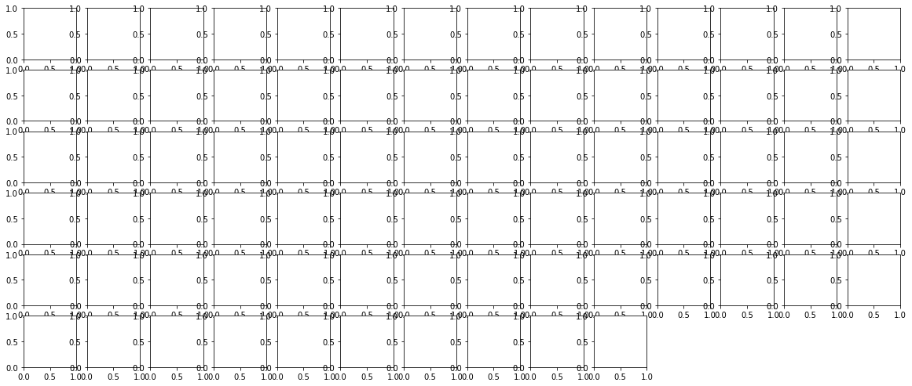

### Questions

### Objectives
YWBAT
* apply feature engineering to data to enhance models

### Outline

What is feature engineering?
- creating features from your data to model the data


```python
import pandas as pd
import numpy as np

import statsmodels.api as sm

from sklearn.datasets import load_boston
from sklearn.linear_model import LinearRegression
from sklearn.model_selection import train_test_split, cross_val_score
from pprint import pprint

import matplotlib.pyplot as plt
import seaborn as sns
```

    /anaconda3/lib/python3.6/site-packages/statsmodels/compat/pandas.py:56: FutureWarning: The pandas.core.datetools module is deprecated and will be removed in a future version. Please use the pandas.tseries module instead.
      from pandas.core import datetools


```python
boston = load_boston()
data = boston.data
target = boston.target
columns = list(boston.feature_names) + ['target']
data = np.column_stack([data, target])
```


```python
pprint(boston.DESCR)
```

    ('.. _boston_dataset:\n'
     '\n'
     'Boston house prices dataset\n'
     '---------------------------\n'
     '\n'
     '**Data Set Characteristics:**  \n'
     '\n'
     '    :Number of Instances: 506 \n'
     '\n'
     '    :Number of Attributes: 13 numeric/categorical predictive. Median Value '
     '(attribute 14) is usually the target.\n'
     '\n'
     '    :Attribute Information (in order):\n'
     '        - CRIM     per capita crime rate by town\n'
     '        - ZN       proportion of residential land zoned for lots over 25,000 '
     'sq.ft.\n'
     '        - INDUS    proportion of non-retail business acres per town\n'
     '        - CHAS     Charles River dummy variable (= 1 if tract bounds river; '
     '0 otherwise)\n'
     '        - NOX      nitric oxides concentration (parts per 10 million)\n'
     '        - RM       average number of rooms per dwelling\n'
     '        - AGE      proportion of owner-occupied units built prior to 1940\n'
     '        - DIS      weighted distances to five Boston employment centres\n'
     '        - RAD      index of accessibility to radial highways\n'
     '        - TAX      full-value property-tax rate per $10,000\n'
     '        - PTRATIO  pupil-teacher ratio by town\n'
     '        - B        1000(Bk - 0.63)^2 where Bk is the proportion of blacks by '
     'town\n'
     '        - LSTAT    % lower status of the population\n'
     "        - MEDV     Median value of owner-occupied homes in $1000's\n"
     '\n'
     '    :Missing Attribute Values: None\n'
     '\n'
     '    :Creator: Harrison, D. and Rubinfeld, D.L.\n'
     '\n'
     'This is a copy of UCI ML housing dataset.\n'
     'https://archive.ics.uci.edu/ml/machine-learning-databases/housing/\n'
     '\n'
     '\n'
     'This dataset was taken from the StatLib library which is maintained at '
     'Carnegie Mellon University.\n'
     '\n'
     "The Boston house-price data of Harrison, D. and Rubinfeld, D.L. 'Hedonic\n"
     "prices and the demand for clean air', J. Environ. Economics & Management,\n"
     "vol.5, 81-102, 1978.   Used in Belsley, Kuh & Welsch, 'Regression "
     'diagnostics\n'
     "...', Wiley, 1980.   N.B. Various transformations are used in the table on\n"
     'pages 244-261 of the latter.\n'
     '\n'
     'The Boston house-price data has been used in many machine learning papers '
     'that address regression\n'
     'problems.   \n'
     '     \n'
     '.. topic:: References\n'
     '\n'
     "   - Belsley, Kuh & Welsch, 'Regression diagnostics: Identifying Influential "
     "Data and Sources of Collinearity', Wiley, 1980. 244-261.\n"
     '   - Quinlan,R. (1993). Combining Instance-Based and Model-Based Learning. '
     'In Proceedings on the Tenth International Conference of Machine Learning, '
     '236-243, University of Massachusetts, Amherst. Morgan Kaufmann.\n')


```python
df = pd.DataFrame(data, columns=columns)
df['target'] = 1000*df['target']
df.head()
```


<div>
<style scoped>
    .dataframe tbody tr th:only-of-type {
        vertical-align: middle;
    }

    .dataframe tbody tr th {
        vertical-align: top;
    }

    .dataframe thead th {
        text-align: right;
    }
</style>
<table border="1" class="dataframe">
  <thead>
    <tr style="text-align: right;">
      <th></th>
      <th>CRIM</th>
      <th>ZN</th>
      <th>INDUS</th>
      <th>CHAS</th>
      <th>NOX</th>
      <th>RM</th>
      <th>AGE</th>
      <th>DIS</th>
      <th>RAD</th>
      <th>TAX</th>
      <th>PTRATIO</th>
      <th>B</th>
      <th>LSTAT</th>
      <th>target</th>
    </tr>
  </thead>
  <tbody>
    <tr>
      <th>0</th>
      <td>0.00632</td>
      <td>18.0</td>
      <td>2.31</td>
      <td>0.0</td>
      <td>0.538</td>
      <td>6.575</td>
      <td>65.2</td>
      <td>4.0900</td>
      <td>1.0</td>
      <td>296.0</td>
      <td>15.3</td>
      <td>396.90</td>
      <td>4.98</td>
      <td>24000.0</td>
    </tr>
    <tr>
      <th>1</th>
      <td>0.02731</td>
      <td>0.0</td>
      <td>7.07</td>
      <td>0.0</td>
      <td>0.469</td>
      <td>6.421</td>
      <td>78.9</td>
      <td>4.9671</td>
      <td>2.0</td>
      <td>242.0</td>
      <td>17.8</td>
      <td>396.90</td>
      <td>9.14</td>
      <td>21600.0</td>
    </tr>
    <tr>
      <th>2</th>
      <td>0.02729</td>
      <td>0.0</td>
      <td>7.07</td>
      <td>0.0</td>
      <td>0.469</td>
      <td>7.185</td>
      <td>61.1</td>
      <td>4.9671</td>
      <td>2.0</td>
      <td>242.0</td>
      <td>17.8</td>
      <td>392.83</td>
      <td>4.03</td>
      <td>34700.0</td>
    </tr>
    <tr>
      <th>3</th>
      <td>0.03237</td>
      <td>0.0</td>
      <td>2.18</td>
      <td>0.0</td>
      <td>0.458</td>
      <td>6.998</td>
      <td>45.8</td>
      <td>6.0622</td>
      <td>3.0</td>
      <td>222.0</td>
      <td>18.7</td>
      <td>394.63</td>
      <td>2.94</td>
      <td>33400.0</td>
    </tr>
    <tr>
      <th>4</th>
      <td>0.06905</td>
      <td>0.0</td>
      <td>2.18</td>
      <td>0.0</td>
      <td>0.458</td>
      <td>7.147</td>
      <td>54.2</td>
      <td>6.0622</td>
      <td>3.0</td>
      <td>222.0</td>
      <td>18.7</td>
      <td>396.90</td>
      <td>5.33</td>
      <td>36200.0</td>
    </tr>
  </tbody>
</table>
</div>


### Dropping my high target values (outlier)


```python
df = df[df['target'] < 40000]
```


```python
pd.plotting.scatter_matrix(df, figsize=(20, 20))
plt.show()
```


    -------------------------------------------------------------------------

    KeyboardInterrupt                       Traceback (most recent call last)

    <ipython-input-6-96f0f7ec8464> in <module>()
    ----> 1 pd.plotting.scatter_matrix(df, figsize=(20, 20))
          2 plt.show()


    /anaconda3/lib/python3.6/site-packages/pandas/plotting/_misc.py in scatter_matrix(frame, alpha, figsize, ax, grid, diagonal, marker, density_kwds, hist_kwds, range_padding, **kwds)
         58     naxes = n * n
         59     fig, axes = _subplots(naxes=naxes, figsize=figsize, ax=ax,
    ---> 60                           squeeze=False)
         61 
         62     # no gaps between subplots


    /anaconda3/lib/python3.6/site-packages/pandas/plotting/_tools.py in _subplots(naxes, sharex, sharey, squeeze, subplot_kw, ax, layout, layout_type, **fig_kw)
        253             kwds['sharex'] = None
        254             kwds['sharey'] = None
    --> 255         ax = fig.add_subplot(nrows, ncols, i + 1, **kwds)
        256         axarr[i] = ax
        257 


    /anaconda3/lib/python3.6/site-packages/matplotlib/figure.py in add_subplot(self, *args, **kwargs)
       1072                     self._axstack.remove(ax)
       1073 
    -> 1074             a = subplot_class_factory(projection_class)(self, *args, **kwargs)
       1075 
       1076         self._axstack.add(key, a)


    /anaconda3/lib/python3.6/site-packages/matplotlib/axes/_subplots.py in __init__(self, fig, *args, **kwargs)
         71 
         72         # _axes_class is set in the subplot_class_factory
    ---> 73         self._axes_class.__init__(self, fig, self.figbox, **kwargs)
         74 
         75     def __reduce__(self):


    /anaconda3/lib/python3.6/site-packages/matplotlib/axes/_base.py in __init__(self, fig, rect, facecolor, frameon, sharex, sharey, label, xscale, yscale, axisbg, **kwargs)
        539 
        540         self._connected = {}  # a dict from events to (id, func)
    --> 541         self.cla()
        542         # funcs used to format x and y - fall back on major formatters
        543         self.fmt_xdata = None


    /anaconda3/lib/python3.6/site-packages/matplotlib/axes/_base.py in cla(self)
        977         yaxis_visible = self.yaxis.get_visible()
        978 
    --> 979         self.xaxis.cla()
        980         self.yaxis.cla()
        981         for name, spine in six.iteritems(self.spines):


    /anaconda3/lib/python3.6/site-packages/matplotlib/axis.py in cla(self)
        742     def cla(self):
        743         'clear the current axis'
    --> 744         self.set_major_locator(mticker.AutoLocator())
        745         self.set_major_formatter(mticker.ScalarFormatter())
        746         self.set_minor_locator(mticker.NullLocator())


    /anaconda3/lib/python3.6/site-packages/matplotlib/ticker.py in __init__(self)
       2489             nbins = 'auto'
       2490             steps = [1, 2, 2.5, 5, 10]
    -> 2491         MaxNLocator.__init__(self, nbins=nbins, steps=steps)
       2492 
       2493 


    /anaconda3/lib/python3.6/site-packages/matplotlib/ticker.py in __init__(self, *args, **kwargs)
       1838                 raise ValueError(
       1839                     "Keywords are required for all arguments except 'nbins'")
    -> 1840         self.set_params(**self.default_params)
       1841         self.set_params(**kwargs)
       1842 


    /anaconda3/lib/python3.6/site-packages/matplotlib/ticker.py in set_params(self, **kwargs)
       1894             else:
       1895                 self._steps = self._validate_steps(steps)
    -> 1896             self._extended_steps = self._staircase(self._steps)
       1897         if 'integer' in kwargs:
       1898             self._integer = kwargs['integer']


    /anaconda3/lib/python3.6/site-packages/matplotlib/ticker.py in _staircase(steps)
       1865         # step will be found.  This is probably much larger
       1866         # than necessary.
    -> 1867         flights = (0.1 * steps[:-1], steps, 10 * steps[1])
       1868         return np.hstack(flights)
       1869 


    KeyboardInterrupt: 





```python
plt.hist(df["RAD"], bins=20)
```


```python
df.RAD.value_counts()
```


    24.0    127
    4.0     107
    5.0     103
    3.0      36
    6.0      26
    2.0      22
    8.0      19
    1.0      19
    7.0      16
    Name: RAD, dtype: int64


```python
rad_categories = []
for rad in df.RAD:
    if rad > 10:
        rad_categories.append(1)
    else:
        rad_categories.append(0)
```


```python
df["rad_cat"] = rad_categories
df.head()
```


<div>
<style scoped>
    .dataframe tbody tr th:only-of-type {
        vertical-align: middle;
    }

    .dataframe tbody tr th {
        vertical-align: top;
    }

    .dataframe thead th {
        text-align: right;
    }
</style>
<table border="1" class="dataframe">
  <thead>
    <tr style="text-align: right;">
      <th></th>
      <th>CRIM</th>
      <th>ZN</th>
      <th>INDUS</th>
      <th>CHAS</th>
      <th>NOX</th>
      <th>RM</th>
      <th>AGE</th>
      <th>DIS</th>
      <th>RAD</th>
      <th>TAX</th>
      <th>PTRATIO</th>
      <th>B</th>
      <th>LSTAT</th>
      <th>target</th>
      <th>rad_cat</th>
    </tr>
  </thead>
  <tbody>
    <tr>
      <th>0</th>
      <td>0.00632</td>
      <td>18.0</td>
      <td>2.31</td>
      <td>0.0</td>
      <td>0.538</td>
      <td>6.575</td>
      <td>65.2</td>
      <td>4.0900</td>
      <td>1.0</td>
      <td>296.0</td>
      <td>15.3</td>
      <td>396.90</td>
      <td>4.98</td>
      <td>24000.0</td>
      <td>0</td>
    </tr>
    <tr>
      <th>1</th>
      <td>0.02731</td>
      <td>0.0</td>
      <td>7.07</td>
      <td>0.0</td>
      <td>0.469</td>
      <td>6.421</td>
      <td>78.9</td>
      <td>4.9671</td>
      <td>2.0</td>
      <td>242.0</td>
      <td>17.8</td>
      <td>396.90</td>
      <td>9.14</td>
      <td>21600.0</td>
      <td>0</td>
    </tr>
    <tr>
      <th>2</th>
      <td>0.02729</td>
      <td>0.0</td>
      <td>7.07</td>
      <td>0.0</td>
      <td>0.469</td>
      <td>7.185</td>
      <td>61.1</td>
      <td>4.9671</td>
      <td>2.0</td>
      <td>242.0</td>
      <td>17.8</td>
      <td>392.83</td>
      <td>4.03</td>
      <td>34700.0</td>
      <td>0</td>
    </tr>
    <tr>
      <th>3</th>
      <td>0.03237</td>
      <td>0.0</td>
      <td>2.18</td>
      <td>0.0</td>
      <td>0.458</td>
      <td>6.998</td>
      <td>45.8</td>
      <td>6.0622</td>
      <td>3.0</td>
      <td>222.0</td>
      <td>18.7</td>
      <td>394.63</td>
      <td>2.94</td>
      <td>33400.0</td>
      <td>0</td>
    </tr>
    <tr>
      <th>4</th>
      <td>0.06905</td>
      <td>0.0</td>
      <td>2.18</td>
      <td>0.0</td>
      <td>0.458</td>
      <td>7.147</td>
      <td>54.2</td>
      <td>6.0622</td>
      <td>3.0</td>
      <td>222.0</td>
      <td>18.7</td>
      <td>396.90</td>
      <td>5.33</td>
      <td>36200.0</td>
      <td>0</td>
    </tr>
  </tbody>
</table>
</div>


```python
plt.figure(figsize=(10, 10))
sns.violinplot(x="rad_cat", y="target", data=df)
plt.show()
```


```python
df.shape
```


    (475, 15)


```python
np.corrcoef(df.target, df.rad_cat)
```


    array([[ 1.        , -0.51815814],
           [-0.51815814,  1.        ]])


```python
plt.hist(df.AGE, bins=20)
```


    (array([  7.,   6.,   7.,  22.,   5.,  21.,  22.,  17.,  18.,  13.,  18.,
             18.,  16.,  20.,  18.,  22.,  33.,  34.,  54., 104.]),
     array([  2.9  ,   7.755,  12.61 ,  17.465,  22.32 ,  27.175,  32.03 ,
             36.885,  41.74 ,  46.595,  51.45 ,  56.305,  61.16 ,  66.015,
             70.87 ,  75.725,  80.58 ,  85.435,  90.29 ,  95.145, 100.   ]),
     <a list of 20 Patch objects>)


```python
plt.hist(df.CRIM, bins=30)
```


    (array([347.,  38.,  24.,  21.,  15.,   7.,   7.,   3.,   4.,   1.,   0.,
              0.,   2.,   0.,   1.,   1.,   0.,   1.,   0.,   0.,   0.,   0.,
              1.,   0.,   1.,   0.,   0.,   0.,   0.,   1.]),
     array([6.32000000e-03, 2.97198267e+00, 5.93764533e+00, 8.90330800e+00,
            1.18689707e+01, 1.48346333e+01, 1.78002960e+01, 2.07659587e+01,
            2.37316213e+01, 2.66972840e+01, 2.96629467e+01, 3.26286093e+01,
            3.55942720e+01, 3.85599347e+01, 4.15255973e+01, 4.44912600e+01,
            4.74569227e+01, 5.04225853e+01, 5.33882480e+01, 5.63539107e+01,
            5.93195733e+01, 6.22852360e+01, 6.52508987e+01, 6.82165613e+01,
            7.11822240e+01, 7.41478867e+01, 7.71135493e+01, 8.00792120e+01,
            8.30448747e+01, 8.60105373e+01, 8.89762000e+01]),
     <a list of 30 Patch objects>)


```python
df.CRIM.value_counts()
```


    14.33370    2
    0.08265     1
    0.66351     1
    0.02498     1
    0.10000     1
    0.05515     1
    0.11027     1
    0.01501     1
    4.26131     1
    0.34109     1
    22.59710    1
    0.28955     1
    4.34879     1
    0.10574     1
    3.47428     1
    5.66637     1
    15.87440    1
    0.04297     1
    0.78570     1
    0.29090     1
    1.23247     1
    2.44953     1
    0.09512     1
    0.05425     1
    0.17783     1
    88.97620    1
    0.11747     1
    0.03445     1
    0.34940     1
    0.12650     1
               ..
    5.69175     1
    3.16360     1
    0.07022     1
    0.02187     1
    8.05579     1
    10.06230    1
    41.52920    1
    0.32264     1
    0.04379     1
    0.22212     1
    0.13117     1
    0.51183     1
    6.28807     1
    0.08826     1
    24.80170    1
    0.09065     1
    23.64820    1
    3.56868     1
    12.80230    1
    0.72580     1
    0.03113     1
    13.67810    1
    0.88125     1
    0.01951     1
    0.49298     1
    0.26838     1
    0.11460     1
    0.03237     1
    2.73397     1
    0.84054     1
    Name: CRIM, Length: 474, dtype: int64


```python
df.CRIM.describe()
```


    count    475.000000
    mean       3.747852
    std        8.838669
    min        0.006320
    25%        0.082545
    50%        0.241030
    75%        3.735965
    max       88.976200
    Name: CRIM, dtype: float64


```python
plt.hist(df.CRIM, bins=30)
plt.show()
```


```python
df["high_crime"] = [1 if crime > 3.7 else 0 for crime in df.CRIM]
```


```python
plt.hist(df.high_crime)
```


    (array([356.,   0.,   0.,   0.,   0.,   0.,   0.,   0.,   0., 119.]),
     array([0. , 0.1, 0.2, 0.3, 0.4, 0.5, 0.6, 0.7, 0.8, 0.9, 1. ]),
     <a list of 10 Patch objects>)


```python
plt.figure(figsize=(10, 10))
sns.violinplot(x="rad_cat", y="target", data=df, hue='high_crime', split=True)
plt.show()
```


```python
plt.scatter(x=df.RAD, y=df.target, c=df.high_crime, alpha=0.5)
plt.xlabel('rad')
plt.ylabel('target')
plt.show()
```


```python
rad_crime = []
for crime, rad in zip(df.high_crime, df.rad_cat):
    if crime == 1 and rad == 1:
        rad_crime.append(1)
    else:
        rad_crime.append(0)
df['rad_crime'] = rad_crime
df.head()
```


<div>
<style scoped>
    .dataframe tbody tr th:only-of-type {
        vertical-align: middle;
    }

    .dataframe tbody tr th {
        vertical-align: top;
    }

    .dataframe thead th {
        text-align: right;
    }
</style>
<table border="1" class="dataframe">
  <thead>
    <tr style="text-align: right;">
      <th></th>
      <th>CRIM</th>
      <th>ZN</th>
      <th>INDUS</th>
      <th>CHAS</th>
      <th>NOX</th>
      <th>RM</th>
      <th>AGE</th>
      <th>DIS</th>
      <th>RAD</th>
      <th>TAX</th>
      <th>PTRATIO</th>
      <th>B</th>
      <th>LSTAT</th>
      <th>target</th>
      <th>rad_cat</th>
      <th>high_crime</th>
      <th>rad_crime</th>
    </tr>
  </thead>
  <tbody>
    <tr>
      <th>0</th>
      <td>0.00632</td>
      <td>18.0</td>
      <td>2.31</td>
      <td>0.0</td>
      <td>0.538</td>
      <td>6.575</td>
      <td>65.2</td>
      <td>4.0900</td>
      <td>1.0</td>
      <td>296.0</td>
      <td>15.3</td>
      <td>396.90</td>
      <td>4.98</td>
      <td>24000.0</td>
      <td>0</td>
      <td>0</td>
      <td>0</td>
    </tr>
    <tr>
      <th>1</th>
      <td>0.02731</td>
      <td>0.0</td>
      <td>7.07</td>
      <td>0.0</td>
      <td>0.469</td>
      <td>6.421</td>
      <td>78.9</td>
      <td>4.9671</td>
      <td>2.0</td>
      <td>242.0</td>
      <td>17.8</td>
      <td>396.90</td>
      <td>9.14</td>
      <td>21600.0</td>
      <td>0</td>
      <td>0</td>
      <td>0</td>
    </tr>
    <tr>
      <th>2</th>
      <td>0.02729</td>
      <td>0.0</td>
      <td>7.07</td>
      <td>0.0</td>
      <td>0.469</td>
      <td>7.185</td>
      <td>61.1</td>
      <td>4.9671</td>
      <td>2.0</td>
      <td>242.0</td>
      <td>17.8</td>
      <td>392.83</td>
      <td>4.03</td>
      <td>34700.0</td>
      <td>0</td>
      <td>0</td>
      <td>0</td>
    </tr>
    <tr>
      <th>3</th>
      <td>0.03237</td>
      <td>0.0</td>
      <td>2.18</td>
      <td>0.0</td>
      <td>0.458</td>
      <td>6.998</td>
      <td>45.8</td>
      <td>6.0622</td>
      <td>3.0</td>
      <td>222.0</td>
      <td>18.7</td>
      <td>394.63</td>
      <td>2.94</td>
      <td>33400.0</td>
      <td>0</td>
      <td>0</td>
      <td>0</td>
    </tr>
    <tr>
      <th>4</th>
      <td>0.06905</td>
      <td>0.0</td>
      <td>2.18</td>
      <td>0.0</td>
      <td>0.458</td>
      <td>7.147</td>
      <td>54.2</td>
      <td>6.0622</td>
      <td>3.0</td>
      <td>222.0</td>
      <td>18.7</td>
      <td>396.90</td>
      <td>5.33</td>
      <td>36200.0</td>
      <td>0</td>
      <td>0</td>
      <td>0</td>
    </tr>
  </tbody>
</table>
</div>


```python
corr = df[['CRIM', 'RAD', 'target']].corr()
corr.head()
```


<div>
<style scoped>
    .dataframe tbody tr th:only-of-type {
        vertical-align: middle;
    }

    .dataframe tbody tr th {
        vertical-align: top;
    }

    .dataframe thead th {
        text-align: right;
    }
</style>
<table border="1" class="dataframe">
  <thead>
    <tr style="text-align: right;">
      <th></th>
      <th>CRIM</th>
      <th>RAD</th>
      <th>target</th>
    </tr>
  </thead>
  <tbody>
    <tr>
      <th>CRIM</th>
      <td>1.000000</td>
      <td>0.625818</td>
      <td>-0.488403</td>
    </tr>
    <tr>
      <th>RAD</th>
      <td>0.625818</td>
      <td>1.000000</td>
      <td>-0.509836</td>
    </tr>
    <tr>
      <th>target</th>
      <td>-0.488403</td>
      <td>-0.509836</td>
      <td>1.000000</td>
    </tr>
  </tbody>
</table>
</div>


```python
corr.shape
```


    (3, 3)


```python
sns.heatmap(corr, fmt='0.2g', annot=True, cmap=sns.color_palette('coolwarm'))
plt.show()
```


```python
plt.figure(figsize=(10, 10))
sns.violinplot(x='rad_crime', y='target', data=df)
plt.show()
```


```python
np.corrcoef([df.CRIM + df.RAD], df.target)
```


    array([[ 1.        , -0.55354958],
           [-0.55354958,  1.        ]])


```python
x = df.crime_rad_feature
y = df.target
linreg = sm.OLS(y, x).fit()
linreg.summary()
```


<table class="simpletable">
<caption>OLS Regression Results</caption>
<tr>
  <th>Dep. Variable:</th>         <td>target</td>      <th>  R-squared:         </th> <td>   0.249</td> 
</tr>
<tr>
  <th>Model:</th>                   <td>OLS</td>       <th>  Adj. R-squared:    </th> <td>   0.248</td> 
</tr>
<tr>
  <th>Method:</th>             <td>Least Squares</td>  <th>  F-statistic:       </th> <td>   157.3</td> 
</tr>
<tr>
  <th>Date:</th>             <td>Tue, 28 May 2019</td> <th>  Prob (F-statistic):</th> <td>2.30e-31</td> 
</tr>
<tr>
  <th>Time:</th>                 <td>15:06:32</td>     <th>  Log-Likelihood:    </th> <td> -5355.0</td> 
</tr>
<tr>
  <th>No. Observations:</th>      <td>   475</td>      <th>  AIC:               </th> <td>1.071e+04</td>
</tr>
<tr>
  <th>Df Residuals:</th>          <td>   474</td>      <th>  BIC:               </th> <td>1.072e+04</td>
</tr>
<tr>
  <th>Df Model:</th>              <td>     1</td>      <th>                     </th>     <td> </td>    
</tr>
<tr>
  <th>Covariance Type:</th>      <td>nonrobust</td>    <th>                     </th>     <td> </td>    
</tr>
</table>
<table class="simpletable">
<tr>
          <td></td>             <th>coef</th>     <th>std err</th>      <th>t</th>      <th>P>|t|</th>  <th>[0.025</th>    <th>0.975]</th>  
</tr>
<tr>
  <th>crime_rad_feature</th> <td> 1037.6812</td> <td>   82.730</td> <td>   12.543</td> <td> 0.000</td> <td>  875.118</td> <td> 1200.245</td>
</tr>
</table>
<table class="simpletable">
<tr>
  <th>Omnibus:</th>       <td>84.877</td> <th>  Durbin-Watson:     </th> <td>   0.109</td>
</tr>
<tr>
  <th>Prob(Omnibus):</th> <td> 0.000</td> <th>  Jarque-Bera (JB):  </th> <td> 137.298</td>
</tr>
<tr>
  <th>Skew:</th>          <td>-1.097</td> <th>  Prob(JB):          </th> <td>1.53e-30</td>
</tr>
<tr>
  <th>Kurtosis:</th>      <td> 4.456</td> <th>  Cond. No.          </th> <td>    1.00</td>
</tr>
</table>


```python
weights = np.linspace(0, 1, 10000)
max_corr = -1
desired_weights = None
corrs = []

for index, weight in enumerate(weights):
    w1 = weight
    w2 = 1 - weight
    vals = w1*df.CRIM + w2*df.RAD
    corr_coeff = np.abs(np.corrcoef(vals, df.target))[0][1]
    if corr_coeff > max_corr:
        desired_weights = [w1, w2]
        max_corr = corr_coeff
    corrs.append(corr_coeff)        
desired_weights
```


    [0.451945194519452, 0.5480548054805481]


```python
plt.figure(figsize=(8, 5))
plt.plot(weights, corrs)
plt.xlabel("weights")
plt.ylabel("corr coeff")
plt.show()
```


```python
df['crime_rad_feature'] = desired_weights[0]*df.CRIM + desired_weights[1]*df.RAD
```

### Assessment
